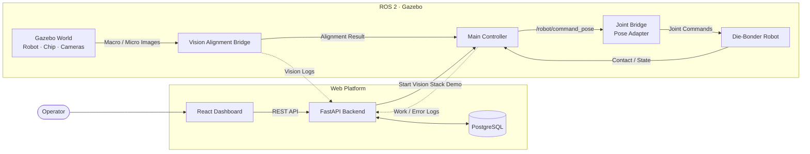
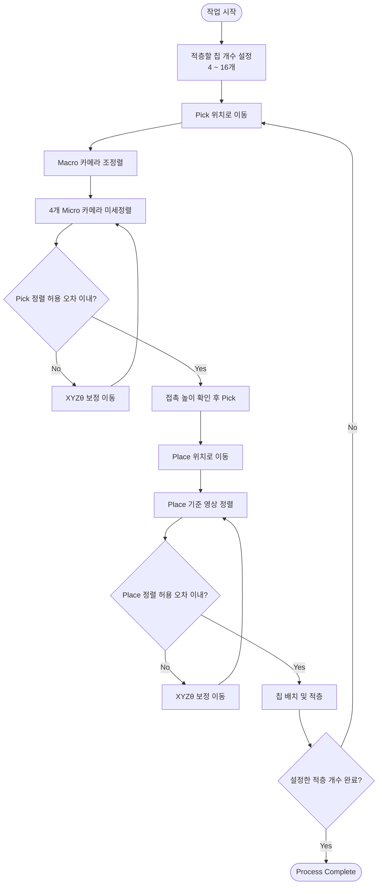

<div align="center">

# 🤖 INHA Vision Die-Bonder Simulator

### ROS 2 · Gazebo · OpenCV 기반 반도체 다이 본더 정밀 정렬 시뮬레이터

가상 갠트리 로봇이 카메라 영상으로 칩의 위치 오차를 보정하고,
Pick · Place · 적층 공정을 수행하는 디지털 트윈 프로젝트입니다.


</div>

---

## 🎬 Demo Video

> 데모 영상은 추후 추가 예정입니다.

<!--
GitHub에 영상을 업로드한 뒤 아래 중 하나로 교체하세요.

예시 1. GitHub uploaded asset URL
https://github.com/user-attachments/assets/your-demo-video-id

예시 2. 썸네일 + 링크
[](https://github.com/user-attachments/assets/your-demo-video-id)
-->

</div>

---

## 목차

- [💡 프로젝트 소개](#-프로젝트-소개)
- [✨ 핵심 기능](#-핵심-기능)
- [🏗️ 시스템 구조](#️-시스템-구조)
- [🔄 비전 정렬 및 적층 흐름](#-비전-정렬-및-적층-흐름)
- [🧩 기술 스택](#-기술-스택)
- [🗂️ 저장소 구조](#️-저장소-구조)
- [✅ 실행 환경](#-실행-환경)
- [🚀 빠른 시작](#-빠른-시작)
- [🎮 CLI로 데모 실행](#-cli로-데모-실행)
- [📸 비전 Reference 준비](#-비전-reference-준비)
- [🌐 서비스 주소](#-서비스-주소)
- [🔌 주요 API](#-주요-api)
- [📚 문서](#-문서)
- [⚙️ 주요 환경변수](#️-주요-환경변수)
- [🧪 빌드 및 검증](#-빌드-및-검증)
- [🧰 문제 해결](#-문제-해결)
- [🌿 Git 협업 방식](#-git-협업-방식)

## 💡 프로젝트 소개

반도체 다이 본딩 공정에서는 칩을 목표 위치에 정확히 정렬하고 안정적으로 적층하는 과정이 중요합니다. 이 프로젝트는 실제 장비 없이도 정렬 알고리즘과 로봇 동작, 공정 로그를 함께 검증할 수 있도록 다음 시스템을 하나의 ROS 2 워크스페이스로 구성합니다.

- Gazebo 기반 다이 본더 갠트리 로봇과 칩·기판 시뮬레이션
- Macro 카메라와 4개의 Micro 카메라를 활용한 조정렬·미세정렬
- ROS 2 토픽 기반 위치 명령, 접촉 센서, 카메라 데이터 연결
- FastAPI와 PostgreSQL 기반 작업·에러·비전 정렬 로그 관리
- React 대시보드 기반 공정 상태 및 오차 수렴 시각화
- 웹 버튼으로 시작하는 비전 기반 칩 적층 데모

## ✨ 핵심 기능

| 구분 | 기능 |
| --- | --- |
| 🦾 Robot Simulation | X/Y/Z/θ 축 갠트리 로봇, 칩·기판 모델, 접촉 센서 시뮬레이션 |
| 📷 Vision Alignment | Macro 1대 + Micro 4대 영상 기반 위치·회전 오차 계산 |
| 🎯 Precision Control | 조정렬(Coarse) 후 미세정렬(Fine)을 반복하는 보정 루프 |
| 🧱 Vision Stacking | 비전 정렬 결과를 반영한 Pick · Place · 칩 적층 데모 |
| 🔌 ROS–Gazebo Bridge | 명령 pose, joint command, 카메라 및 contact topic 연결 |
| 🗄️ Data Logging | 작업 이력, 로봇 에러, 카메라별 정렬 offset을 PostgreSQL에 저장 |
| 📊 Web Dashboard | 작업 현황, 에러 빈도, 정렬 오차 수렴 추이 모니터링 |
| 🔐 Authentication | JWT access/refresh token과 HTTP-only cookie 기반 인증 |

## 🏗️ 시스템 구조



## 🔄 비전 정렬 및 적층 흐름



## 🧩 기술 스택

| Layer | Technologies |
| --- | --- |
| Simulation | ROS 2 Humble, Gazebo Fortress, URDF/Xacro, SDF |
| Robotics | `rclpy`, `ros_gz_sim`, `ros_gz_bridge`, ROS 2 Launch |
| Vision | OpenCV, NumPy, SciPy, multi-camera reference matching |
| Backend | FastAPI, Pydantic, asyncpg, JWT, bcrypt |
| Frontend | React 18, Vite 5, Zustand, Recharts, Tailwind CSS |
| Database | PostgreSQL |
| Tooling | Make, colcon, npm, Git/GitHub |

## 🗂️ 디렉토리 구조

```text
ros2_vision_ws/
├── 📁 src/
│   ├── 📁 robot_system_description/  # URDF, Gazebo world, models, sensors
│   ├── 📁 robot_control_pkg/          # 공정 제어 및 vision-stack demo
│   └── 📁 vision_core/                # joint/image bridge와 정렬 노드
├── 📁 vision_node/                    # OpenCV 정렬 알고리즘 및 실험 코드
├── 📁 web_backend/                    # FastAPI, 인증, 서비스, DB 모델
├── 📁 web_frontend/                   # React 모니터링 대시보드
├── 📁 docs/                           # API, 시퀀스, DB 설계 문서
├── Makefile                        # 빌드·실행 명령 모음
├── requirements.txt                # Python 패키지 목록
├── .env.example                    # 백엔드 환경변수 예시
└── README.md
```

## ✅ 실행 환경

| Requirement | Version |
| --- | --- |
| OS | Ubuntu 22.04 LTS |
| ROS 2 | Humble |
| Gazebo | Fortress / Ignition Gazebo |
| Python | 3.10 |
| Node.js | 20.x 권장, 최소 18.18 |
| npm | 9.x 이상 |
| Database | PostgreSQL |

ROS 2, Gazebo, `colcon`, `ros_gz` 패키지는 시스템에 설치되어 있어야 합니다. OpenCV 브리지를 위한 시스템 패키지는 다음과 같이 설치합니다.

```bash
sudo apt update
sudo apt install python3-opencv python3-numpy
```

## 🚀 빠른 시작

### 1. 저장소 및 애플리케이션 의존성 준비

```bash
git clone https://github.com/Tae-Geon-Kim/INHA-Ros2-Vision-Die-Bonder-Sim.git ~/ros2_vision_ws
cd ~/ros2_vision_ws

cp .env.example .env
make install-backend
make install-frontend
make ros-build
```

`.env`의 DB 비밀번호, JWT secret, 초기 관리자 계정은 팀 공유 값으로 변경합니다.

### 2. 데이터베이스 연결

로컬 환경에서 팀 PostgreSQL 서버를 사용할 경우 별도 터미널에 SSH 터널을 유지합니다.

```bash
cd ~/ros2_vision_ws
make db-tunnel
```

기본 연결은 로컬 `54320` 포트를 원격 `54320` 포트로 전달합니다. 포트를 바꾸려면 Make 변수와 `.env`의 `DB_PORT`를 함께 변경합니다.

```bash
make db-tunnel LOCAL_DB_PORT=15432
```

최초 한 번 테이블과 관리자 계정을 준비합니다.

```bash
make init-db
make register-user
```

### 3. Gazebo와 ROS bridge 실행

터미널 1 — Gazebo 카메라 시뮬레이션:

```bash
cd ~/ros2_vision_ws
make gazebo-camera
```

터미널 2 — joint/contact bridge:

```bash
cd ~/ros2_vision_ws
make joint-bridge
```

### 4. 웹 애플리케이션 실행

터미널 3 — FastAPI:

```bash
cd ~/ros2_vision_ws
make backend
```

터미널 4 — React/Vite:

```bash
cd ~/ros2_vision_ws
make frontend
```

브라우저에서 `http://127.0.0.1:5173`에 접속하고 로그인한 뒤 **Start** 버튼을 누릅니다. 버튼은 백엔드에서 다음 명령을 별도 프로세스로 실행합니다.

```bash
make vision-stack-demo
```

버튼으로 데모를 시작했다면 다른 터미널에서 `make vision-stack-demo`를 중복 실행하지 마세요. 두 제어 프로세스가 같은 로봇에 명령을 보내 충돌할 수 있습니다.

## 🎮 CLI로 데모 실행

웹 없이 공정만 실행하려면 Gazebo와 joint bridge를 먼저 켠 후 세 번째 터미널에서 실행합니다.

```bash
cd ~/ros2_vision_ws
make vision-stack-demo
```

주요 기본 파라미터는 실행 시 덮어쓸 수 있습니다.

```bash
make vision-stack-demo \
  PICK_X=500 PICK_Y=400 \
  SECOND_PICK_X=500 SECOND_PICK_Y=0 \
  SECOND_CHIP_THETA_DEG=30 \
  PLACE_X=140 PLACE_Y=0
```

다른 유용한 명령:

```bash
make help                  # 사용 가능한 Make target 확인
make safe                  # 로봇을 안전 위치로 이동
make chip-reset            # 칩 위치 초기화
make model-list            # Gazebo 모델 확인
make vision-demo           # 단일 vision pick/place 데모
make range-demo            # joint 이동 범위 데모
```

## 📸 비전 Reference 준비

비전 데모는 Pick, 빈 기판 Place, 적층 Place 기준 영상을 사용합니다. 기준 이미지를 다시 취득해야 할 때 다음 target을 실행합니다.

```bash
make vision-ref-pick
make vision-ref-place-empty
make vision-ref-place-stacked

# 세 reference 세트를 순서대로 모두 생성
make vision-ref-all
```

기본 reference 경로:

```text
src/robot_system_description/test_images/vision_references/
├── pick/
├── place_empty/
└── place_stacked/
```

## 🌐 서비스 주소

| Service | URL |
| --- | --- |
| React Dashboard | `http://127.0.0.1:5173` |
| FastAPI | `http://127.0.0.1:8000` |
| Swagger UI | `http://127.0.0.1:8000/docs` |
| Health Check | `http://127.0.0.1:8000/health` |

로그인은 `.env`의 `INITIAL_USER_ID`, `INITIAL_USER_PASSWORD` 값을 사용합니다.

## 🔌 주요 API

| Domain | Endpoints |
| --- | --- |
| Authentication | `POST /users/login`, `POST /users/logout`, `POST /users/refresh` |
| Work History | `POST/GET /robot-logs/work-history`, `PATCH /robot-logs/work-history/{history_id}` |
| Robot Error | `POST/GET /robot-logs/errors` |
| Vision Align | `POST/GET /robot-logs/vision-align` |
| Demo Control | `GET /robot-control/demo/status`, `POST /robot-control/demo/start`, `POST /robot-control/demo/stop` |

현재 요청·응답 모델의 기준 문서는 실행 중인 Swagger UI입니다. 별도 문서화 작업은 [📘 API Specification](docs/API%20Specification.md)에서 이어갑니다.

## 📚 문서

| Document | Description |
| --- | --- |
| [📘 백엔드 API 상세 명세서](docs/API%20Specification.md) | 인증, 로그, 로봇 제어 API 명세서 |
| [📈 Project Sequence Diagram](docs/sequence_diagram.md) | 로그인부터 비전 정렬·에러 처리까지의 호출 흐름 |
| [🗃️ Database 구조도](docs/db_table.md) | 사용자, 작업 이력, 에러 및 비전 로그 관계 |
| [⚡ Swagger UI](http://127.0.0.1:8000/docs) | 실행 중인 백엔드의 OpenAPI 문서 |

## ⚙️ 주요 환경변수

```env
# PostgreSQL
DB_HOST=127.0.0.1
DB_PORT=54320
DB_USER=team05_db
DB_PASSWORD=change-me
DB_NAME=team05_db

# JWT
SECRET_KEY=change-me
ACCESS_TOKEN_EXPIRE_MINUTES=30
REFRESH_TOKEN_EXPIRE_DAYS=30

# Initial operator
INITIAL_USER_ID=admin_team05
INITIAL_USER_PASSWORD=change-me
```

프론트 API 주소를 바꿀 때는 `web_frontend/.env`를 사용합니다.

```env
VITE_API_BASE_URL=http://127.0.0.1:8000
```

## 🧪 빌드 및 검증

```bash
# ROS 2 workspace
make ros-build

# ROS package tests
source /opt/ros/humble/setup.bash
source install/setup.bash
colcon test
colcon test-result --verbose

# Frontend production build
cd web_frontend
npm run build
```

## 🧰 문제 해결

<details>
<summary><strong>DB 연결이 거부됩니다</strong></summary>

SSH 터널이 실행 중인지, `.env`의 `DB_HOST`와 `DB_PORT`가 터널 설정과 일치하는지 확인합니다.

```bash
make db-tunnel
```

</details>

<details>
<summary><strong>백엔드가 전역 Python 패키지를 사용합니다</strong></summary>

Makefile은 기본적으로 `.venv/bin/python`을 사용합니다. 가상환경과 의존성을 다시 준비합니다.

```bash
make install-backend
make backend
```

</details>

<details>
<summary><strong>Vite에서 문법 오류가 발생합니다</strong></summary>

Node.js가 너무 오래된 경우가 많습니다. Node 20을 권장합니다.

```bash
nvm install 20
nvm use 20
make install-frontend
make frontend
```

</details>

<details>
<summary><strong>웹 버튼을 눌렀지만 로봇이 움직이지 않습니다</strong></summary>

Gazebo와 joint bridge가 먼저 실행 중인지 확인하고 데모 로그를 확인합니다.

```bash
tail -f ~/ros2_vision_ws/log/robot_demo.log
ros2 node list
ros2 topic list
```

</details>

<details>
<summary><strong>카메라 영상 topic이 보이지 않습니다</strong></summary>

```bash
ros2 topic list | grep image
ros2 topic hz /camera/macro/image
```

실제 topic 이름은 world 및 sensor 설정에 따라 달라질 수 있으므로 `ros2 topic list` 결과를 우선 확인합니다.

</details>

## 🌿 Git 협업 방식

```bash
# 최신 develop 반영
git switch develop
git pull --ff-only origin develop

# 기능 브랜치 생성
git switch -c feature/기능명

# 작업 완료 후 push
git add <변경한-파일>
git commit -m "feat: 작업 내용 요약"
git push -u origin feature/기능명
```

GitHub에서 기능 브랜치 → `develop` 방향으로 Pull Request를 생성합니다.

커밋 prefix 예시:

| Prefix | Use |
| --- | --- |
| `feat` | 새로운 기능 |
| `fix` | 버그 수정 |
| `docs` | 문서 수정 |
| `refactor` | 동작 변경 없는 코드 개선 |
| `test` | 테스트 추가·수정 |
| `chore` | 설정 및 기타 작업 |

---

<div align="center">

### 🎓 INHA University · Team 05

**Vision-guided precision automation for semiconductor die bonding**

</div>
