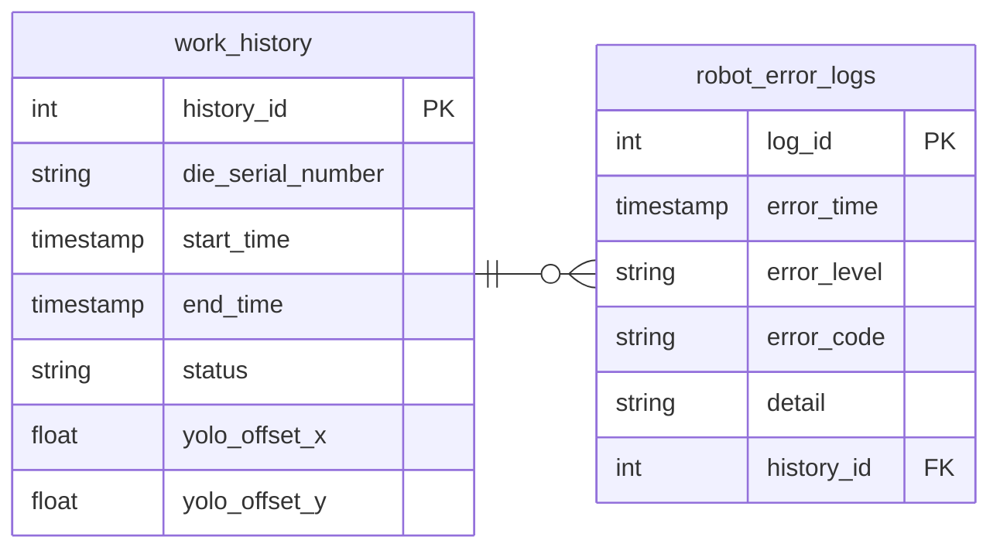

```mermaid
erDiagram
    direction LR
    work_history {
        int history_id PK
        string die_serial_number
        timestamp start_time
        timestamp end_time
        string status
        float yolo_offset_x
        float yolo_offset_y
    }

    robot_error_logs {
        int log_id PK
        timestamp error_time
        string error_level
        string error_code
        string detail
        int history_id FK
    }

    work_history ||--o{ robot_error_logs : ""
```