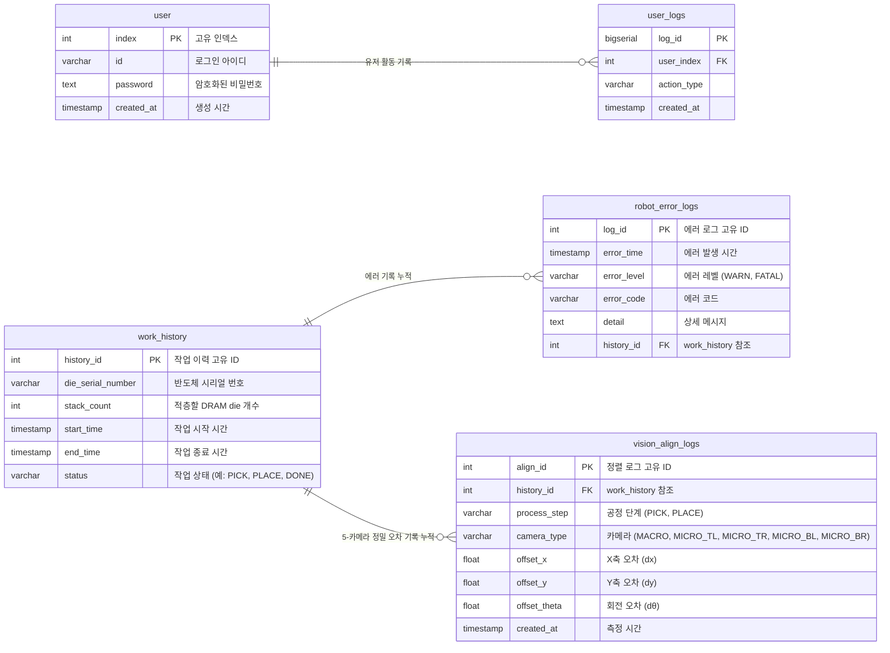

```mermaid
erDiagram
	direction LR
	user {
		int index PK "고유 인덱스"  
		varchar id  "로그인 아이디"  
		text password  "암호화된 비밀번호"  
		timestamp created_at  "생성 시간"  
	}

	user_logs {
		bigserial log_id PK ""  
		int user_index FK ""  
		varchar action_type  ""  
		timestamp created_at  ""  
	}

	work_history {
		int history_id PK "작업 이력 고유 ID"  
		varchar die_serial_number  "반도체 시리얼 번호"  
		int stack_count  "적층할 DRAM die 개수"
		timestamp start_time  "작업 시작 시간"  
		timestamp end_time  "작업 종료 시간"  
		varchar status  "작업 상태 (예: PICK, PLACE, DONE)"  
	}

	robot_error_logs {
		int log_id PK "에러 로그 고유 ID"  
		timestamp error_time  "에러 발생 시간"  
		varchar error_level  "에러 레벨 (WARN, FATAL)"  
		varchar error_code  "에러 코드"  
		text detail  "상세 메시지"  
		int history_id FK "work_history 참조"  
	}

	vision_align_logs {
		int align_id PK "정렬 로그 고유 ID"  
		int history_id FK "work_history 참조"  
		varchar process_step  "공정 단계 (PICK, PLACE)"  
		varchar camera_type  "카메라 (MACRO, MICRO_TL, MICRO_TR, MICRO_BL, MICRO_BR)"  
		float offset_x  "X축 오차 (dx)"  
		float offset_y  "Y축 오차 (dy)"  
		float offset_theta  "회전 오차 (dθ)"  
		timestamp created_at  "측정 시간"  
	}

	user||--o{user_logs:"유저 활동 기록"
	work_history||--o{robot_error_logs:"에러 기록 누적"
	work_history||--o{vision_align_logs:"5-카메라 정밀 오차 기록 누적"
```
