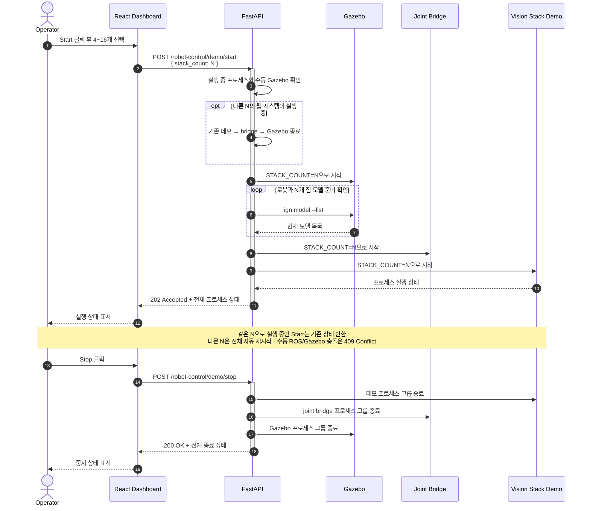

# 웹 기반 비전 적층 시스템 실행 흐름

웹의 Start에서 선택한 `stack_count` 하나가 Gazebo, joint bridge, 비전 적층 데모에 동일하게 적용된다. 웹 모드에서는 세 프로세스를 터미널에서 별도로 실행하지 않는다.

상세 요청·응답과 오류 조건은 [API Specification](API%20Specification.md#10-robot-control-api)을 참고한다.
