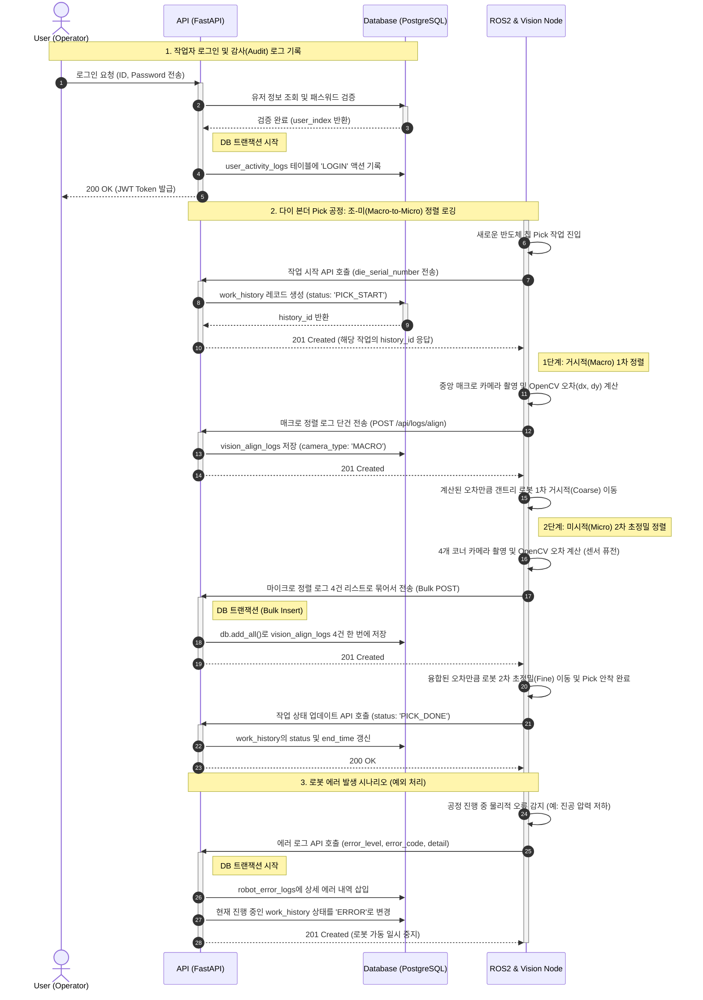

```mermaid
sequenceDiagram
    autonumber
    actor U as User (Operator)
    participant A as API (FastAPI)
    participant D as Database (PostgreSQL)
    participant R as ROS2 & Vision Node

    Note over U, D: 1. 작업자 로그인 및 감사(Audit) 로그 기록
    U->>A: 로그인 요청 (ID, Password 전송)
    activate A
    A->>D: 유저 정보 조회 및 패스워드 검증
    activate D
    D-->>A: 검증 완료 (user_index 반환)
    deactivate D
    
    Note right of A: DB 트랜잭션 시작
    A->>D: user_activity_logs 테이블에 'LOGIN' 액션 기록
    A-->>U: 200 OK (JWT Token 발급)
    deactivate A

    Note over A, R: 2. 다이 본더 Pick 공정: 조-미(Macro-to-Micro) 정렬 로깅
    activate R
    R->>R: 새로운 반도체 칩 Pick 작업 진입
    R->>A: 작업 시작 API 호출 (die_serial_number 전송)
    activate A
    A->>D: work_history 레코드 생성 (status: 'PICK_START')
    activate D
    D-->>A: history_id 반환
    deactivate D
    A-->>R: 201 Created (해당 작업의 history_id 응답)
    deactivate A

    Note right of R: 1단계: 거시적(Macro) 1차 정렬
    R->>R: 중앙 매크로 카메라 촬영 및 OpenCV 오차(dx, dy) 계산
    R->>A: 매크로 정렬 로그 단건 전송 (POST /api/logs/align)
    activate A
    A->>D: vision_align_logs 저장 (camera_type: 'MACRO')
    A-->>R: 201 Created
    deactivate A
    R->>R: 계산된 오차만큼 갠트리 로봇 1차 거시적(Coarse) 이동

    Note right of R: 2단계: 미시적(Micro) 2차 초정밀 정렬
    R->>R: 4개 코너 카메라 촬영 및 OpenCV 오차 계산 (센서 퓨전)
    R->>A: 마이크로 정렬 로그 4건 리스트로 묶어서 전송 (Bulk POST)
    activate A
    Note right of A: DB 트랜잭션 (Bulk Insert)
    A->>D: db.add_all()로 vision_align_logs 4건 한 번에 저장
    A-->>R: 201 Created
    deactivate A
    R->>R: 융합된 오차만큼 로봇 2차 초정밀(Fine) 이동 및 Pick 안착 완료

    R->>A: 작업 상태 업데이트 API 호출 (status: 'PICK_DONE')
    activate A
    A->>D: work_history의 status 및 end_time 갱신
    A-->>R: 200 OK
    deactivate A

    Note over A, R: 3. 로봇 에러 발생 시나리오 (예외 처리)
    R->>R: 공정 진행 중 물리적 오류 감지 (예: 진공 압력 저하)
    R->>A: 에러 로그 API 호출 (error_level, error_code, detail)
    activate A
    Note right of A: DB 트랜잭션 시작
    A->>D: robot_error_logs에 상세 에러 내역 삽입
    A->>D: 현재 진행 중인 work_history 상태를 'ERROR'로 변경
    A-->>R: 201 Created (로봇 가동 일시 중지)
    deactivate A
    deactivate R
```